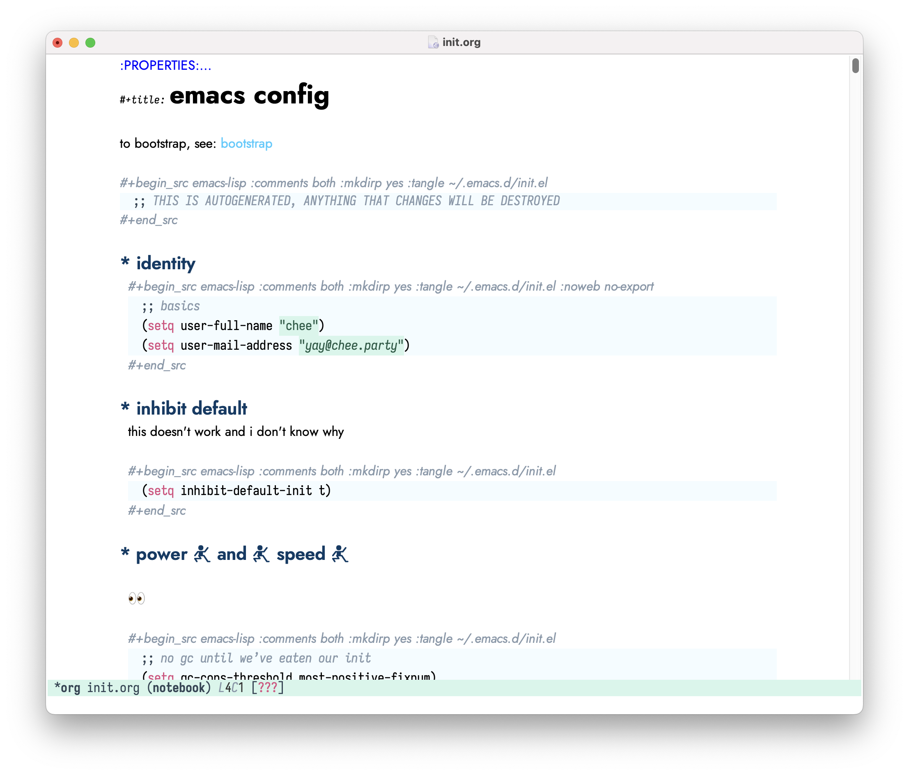

# lychee and friends

a theme by chee

lychee for emacs is a theme for emacs, written by chee.

it is called lychee because it is cute and and tasty.

## installation

### manual

you wanna download it and stick it in `~/.emacs.d/themes`, then add this to your
`~/.emacs` or `~/.emacs.d/init.el`:

```lisp
(add-to-list 'custom-theme-load-path "~/.emacs.d/themes")
```

evaluate that or restart emacs and now you can load the theme!

<kbd>M-x</kbd> <kdb>load-theme</kdb> <kbd>RET</kbd> <kbd>lychee</kbd> <kbd>RET</kbd>

and omg now it looks like this:



## if u have problem

plz tell me by opening an issue or email me at [yay@chee.party](mailto:lychee@chee.party)
ok i love you bye


-- chee
